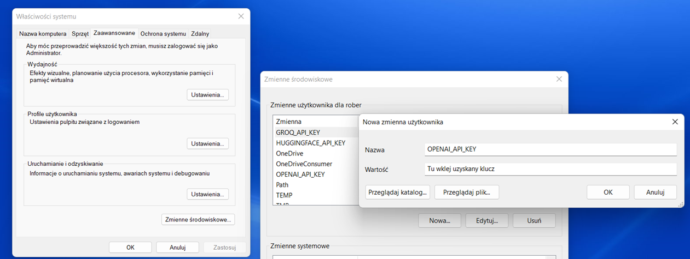
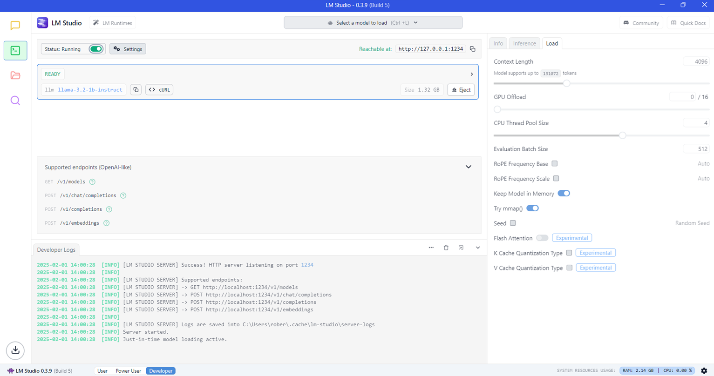

To repozytorium zawiera eksperymenty z modelami LLM oraz kilka technik Prompt Engineeringu. 
Testowanie obejmuje modele dostępne w serwisach OpenAI oraz Groq.
Wykorzystywane są także lokalne modele LLM poprzez LM Studio.

## Struktura Repozytorium

- `1_Prompt_engineering/` – Eksperymenty z różnymi modelami LLM oraz technikami promptowania.
- `2_Talk_with_book_database/` – Skrypt pozwalający porozmawiać z bazą danych książek w formacie xlsx.
- `3_Voice_assistant/` – Mini-aplikacja umożliwiajaca rozmowę głosową z AI, wykorzystująca pakiet Gradio.
- `4_Langchain_tests/` – Testy biblioteki LangChain.
- `Screens/` 

Repozytorium będzie sukcesywnie aktualizowane o nowe pomysły i rozwiązania.

---------------------------------------------------------------------------

## Instalacja

Aby uruchomić skrypty, zainstaluj wymagane biblioteki i uzyskaj klucze do API wybranych platform.

pip install openai groq gradio langchain

## Klucze API

### OpenAI

1. Założ konto na stronie https://platform.openai.com/
2. Przejdź do Settings -> Billing i dodaj kartę aby wykupić kredyty wymagane do korzystania z modeli OpenAI.
3. Opcjonalnie w sekcji Limits ustaw limity kwotowe, po wykorzystaniu których system zablokuje możliwość korzystania z modeli językowych.
4. W sekcji API Keys kliknij +Create new secret key, nazwij go i wygeneruj.
5. Zapisz klucz i nie udostępniaj nikomu.

### Groq

1. Założ konto na stronie https://console.groq.com/
2. W sekcji API Keys kliknij Create API Key, nazwij go, wygeneruj, zapisz i nie pokazuj nikomu.
3. Korzystanie z modeli platformy Groq w podstawowym planie jest darmowe, choć z pewymi ograniczeniami. 
Można jednak sprawdzać potencjalne koszty zużycia tokenów w sekcji Settings -> Usage.

Oba uzyskane klucze najlepiej zapisać w zmiennej środowiskowej systemu operacyjnego.
W moim przypadku jest to Windows 11 Home.
- W wyszukiwarce Windows wpisz "zmienne środowiskowe" i kliknij Edytuj zmienne śodowiskowe systemu.
- W otwartym oknie kliknij button Zmienne środowiskowe...
- Kliknij button Nowa... i dodaj kolejno zmienne o nazwach OPENAI_API_KEY oraz GROQ_API_KEY.

## Uruchomienie LLM w Lm Studio

1. Wejdź na stronę https://lmstudio.ai/
2. Pobierz aplikację LM Studio na swój system.
3. Uruchom aplikację i pobierz pierwszy model proponowany przez system: Llama 3.2 1B Instruct.
4. W sekcji Discover możesz przeszukiwać i pobierać inne dostępne modele. 
(aplikacja poinformuje Cię czy Twój komputer spełnia techniczne wymagania do uruchomienia modelu).
5. Przejdź do sekcji Developer, załaduj wybrany model, przesuń suwak Status na włączony.
6. Wybrany LLM zostanie uruchomiony jako serwer, przez co będziesz mógł go wykorzystać w skrypcie prompt_engineering.ipynb.

## Autor

https://github.com/Robson2k7

